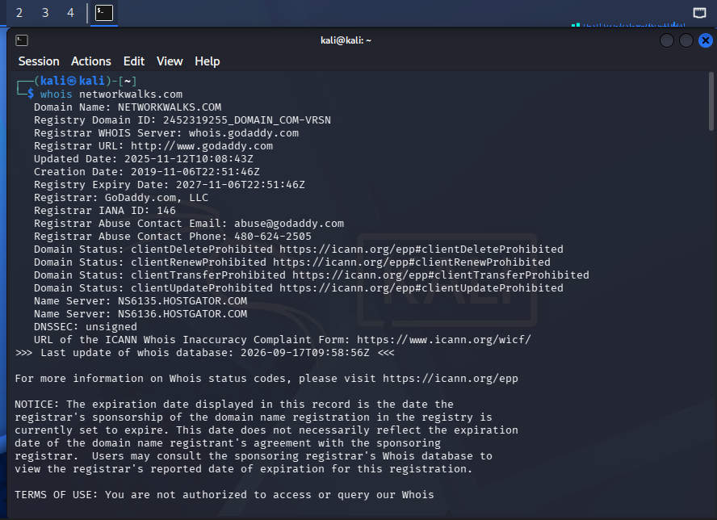
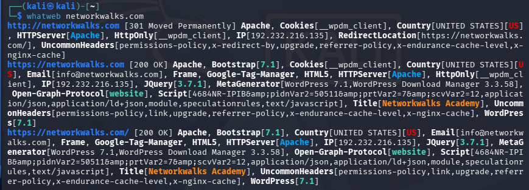
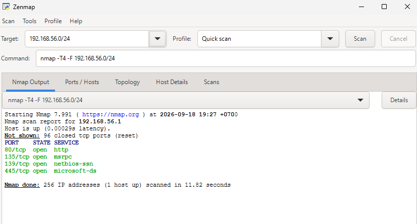
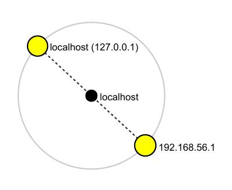

# Week 2 — Footprinting & Network Scanning

Cybersecurity & Ethical Hacking internship at **Networkwalks** — Week 2 practical modules covering reconnaissance/footprinting and local network scanning.

| | |
|---|---|
| **Modules** | W2-PM1 (Multiple Kali Tools) · W2-PM5 (Zenmap Scanning) |
| **Target** | `networkwalks.com` (written permission secured) · own local LAN |
| **Report** | [`W2_Report_Footprinting_Zenmap.pdf`](./reports/W2_Report_Footprinting_Zenmap.pdf) |

> ⚠️ All testing was performed only against systems I own or had explicit written permission to test. See the full report for the liability disclaimer.

## Tools Used

| Tool | Purpose |
|---|---|
| WHOIS | Domain registration details (owner, dates, name servers) |
| WhatWeb | Fingerprint web technologies (server, CMS, plugins, IP) |
| Nslookup | Resolve domain name to IP address |
| curl -I | Inspect HTTP response headers |
| Wafw00f | Detect Web Application Firewall |
| DNSRecon | Enumerate DNS records (NS, MX, SPF, TXT, SRV) |
| Zenmap (Nmap GUI) | Scan local hosts/subnet for open ports and services |

## Key Findings

- **WHOIS** - `networkwalks.com` registered via GoDaddy, privacy-protected registrant, name servers on Hostgator.
- **WhatWeb** - server runs Apache + **WordPress 7.1** with **WordPress Download Manager 3.3.58**; IP `192.232.216.135`.
- **Nslookup** - confirmed domain resolves to `192.232.216.135`.
- **curl -I** - HTTP headers expose the WordPress REST API endpoint `/wp-json/`.
- **Wafw00f** - site is protected by **ModSecurity (SpiderLabs)** WAF.
- **DNSRecon** - enumerated SOA/NS, MX, SPF/TXT, and 8 SRV (autodiscover) records.
- **Zenmap** - quick scans of `192.168.56.0/24` and `127.0.0.1` found open ports **80 (http), 135 (msrpc), 139 (netbios-ssn), 445 (microsoft-ds)** on the local machine.

Full risk ratings, evidence, and recommendations are in the [report](./W2_Report_Footprinting_Zenmap.pdf).

## Evidence

| WHOIS | WhatWeb |
|---|---|
|  |  |

| Zenmap — Subnet Scan | Zenmap — Topology |
|---|---|
|  |  |

## Disclaimer

This work was performed for educational purposes as part of the Networkwalks Cybersecurity internship, only against systems I own or was authorized to test. See Section 1 of the full report for the complete liability disclaimer.

Author
Lana
